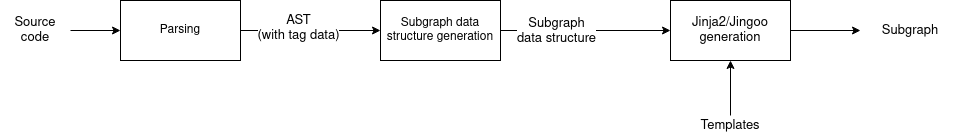

# High level architecture
The GraphGen tool is implemented as a simple pipeline (see diagram) that takes as input one or more solidity file containing interfaces and annotated with GraphGen tags. OCaml with the ReasonML syntax is used as the implementation language due to it's excellent support for writing parsers.

  
   
  <i>GraphGen pipeline</i>
   

## Parsing
The parsing component of GraphGen is implemented in the `Parsing` module, located in `graphgen/parsing/` and can be broken down into three parts: 
- The lexer (implemented with [Menhir](https://opam.ocaml.org/packages/menhir/), see `graphgen/parsing/lexer.mll`)
- The parser (implemented with [Menhir](https://opam.ocaml.org/packages/menhir/), see `graphgen/parsing/parser.mly`)
- The AST defininition (see `graphgen/parsing/ast.re`)

The grammar parsed by GraphGen is a modified version of the solidity grammar. The two main difference are:
1. GraphGen's grammar only parses solidity interfaces (and not contracts)
2. GraphGen's grammar includes the `@gg` tags in the source code's AST

The information written in the `@gg` tag blocks is assumed to be using the yaml format and is parsed using the parser provided by the [yaml](https://opam.ocaml.org/packages/yaml/) package. In a way, GraphGen's parser handles two grammars at once: the solidity grammar of the source code and the yaml grammar of the GraphGen tags.

## Subgraph representation
Once the source files and annotations have been parsed into an AST, GraphGen generates an internal subgraph representation (see `graphgen/subgraph.re/rei`). Without going into too many details, this subgraph representation contains all the information necessary to generate a working subgraph, including the subgraph data sources and templates (not to be confused with Jinja2 templates), the events and functions calls to be handled, what action to take when their handlers are triggered, etc.

## Jinja2/Jingoo templates
Each part of the subgraph (e.g.: subgraph manifest, abis, schema, ...) is generated using Jinja2 templates and the latter can be found in the `templates/` directory. In theory, this means that GraphGen can be modded by editing the template files if one whishes to change some behavior in the generated code. The python dictionaries used in the Jinja2 templates are generated by functions located in the `Models` module (see `graphgen/models.re/rei`).

Note: that we are using the [Jingoo](https://opam.ocaml.org/packages/jingoo/) library to populate our Jinja2 templates which should be almost compatible with the "real" Jinja2 framework. However, we refer to Jingoo's [documentation](https://tategakibunko.github.io/jingoo/) for any questions about what is supported by the templates.