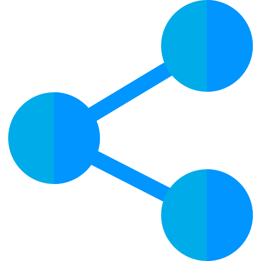

<h1 align="center">GraphGen - A subgraph generator for The Graph Network</h1>

<p align="center">
  
  <br>
  <i>Graphgen aims to facilitate subgraph development by abstracting away simple but common subgraph writing patterns
    <br>  and automating the set up of peripherals.</i>
  <br>
</p>

<p align="center">
  <strong> Conceived by Protean Labs </strong> <br>
  <a href="https://www.protean.so/graphgen"><strong>www.protean.so</strong></a>
  <br>
</p>

<p align="center">
  <a href="CONTRIBUTING.md">Contributing Guidelines</a>
  ·
  <a href="https://github.com/protean-labs/graphgen/issues">Submit an Issue</a>
  ·
  <a href="https://medium.com/protean-labs">Blog</a>
  <br>
  <br>
</p>

<p align="center">
  <a href="https://github.com/protean-labs/graphgen/blob/HEAD/LICENSE">
    
  </a>
  <a href="https://github.com/protean-labs/graphgen/actions/workflows/build.yml">
    
  </a>
  <a href="https://www.npmjs.com/@protean-labs/graphgen">
    
  </a>
  <a href="https://www.npmjs.com/@protean-labs/graphgen">
    
  </a>
    <a href="https://discord.gg/protean-labs">
    
  </a>
  <a href="https://twitter.com/intent/follow?screen_name=proteancrypto">
    
  </a>
</p>

# Getting started

Graphgen is released on the npm.js registry and Github package registry. 

You can install Graphgen globally with:

```
npm i -g @protean-lab/graphgen
```

Basic usage is to call on an already annotated .sol contract file. If installed globally, use npx to call the executable if your $PATH is not already set.

```
npx graphgen [CONTRACT_FILE].sol
``` 


# Usage

Once the package has been downloaded and built in your subgraph folder, it is recommended to make a copy of you solidity interface files and move the copies to the folder. You should also remove any comments from them to prevent any interference with the parsers. Once this is done, you can start adding annotations according to the following specs:

## Annotations

UniswapV2 is used as an example here to show possible annotations. You can find the complete file under `test/IUniswapV2.sol`

- Source -
  Specifies the usual DataSources found in most subgraphs. It is possible to generate both unique sources and source templates which are usually used for contract factories.

```Solidity
/* @gg:source
  name: Pair
  onInit:
    - UpdateField name
    - UpdateField symbol
    - UpdateField decimals
    - UpdateField totalSupply
    - UpdateField token0
    - UpdateField token1
*/

interface IUniswapV2Pair {
    event Approval(address indexed owner, address indexed spender, uint value);
    event Transfer(address indexed from, address indexed to, uint value);
    ...
}
```

- Handler
  - StoreCall
  - StoreEvent
  - UpdateField
  - NewEntity

```Solidity
    /* @gg:handler 
        actions:
          - StoreEvent
          - UpdateField totalSupply
     */
    event Burn(address indexed sender, uint amount0, uint amount1, address indexed to);

    /* @gg:handler 
        actions:
          - StoreEvent
          - UpdateField price0
          - UpdateField price1
     */
    event Swap(
        address indexed sender,
        uint amount0In,
        uint amount1In,
        uint amount0Out,
        uint amount1Out,
        address indexed to
    );
```

- Fields - They specify the attributes of each entity that is tracked by the subgraph.

```Solidity
    /* @gg:field */
    function name() external pure returns (string memory);
    
    /* @gg:field */
    function symbol() external pure returns (string memory);

```

## CLI

`graphgen --graph_account --subgraph_name --path_to_folder`

## Example

## Generated Subgraph

- Subgraph Manifest
- Package.json
- Graphql Interface
- Typescript mappings and utils files
- abis

# Technologies

Graphgen uses parser generator technologies in order to leverage the information that resides in solidity interface files. It is written with the OCaml/ReasonML toolchain and compiled to native OCaml code.

# About us

We at Protean Labs focus on building various pieces of infrastructure and developer tooling around the Web3 ecosystem. You can reach out to us through our multiple social accounts and at <a href="https://www.protean.so/graphgen"><strong>www.protean.so</strong></a>.
